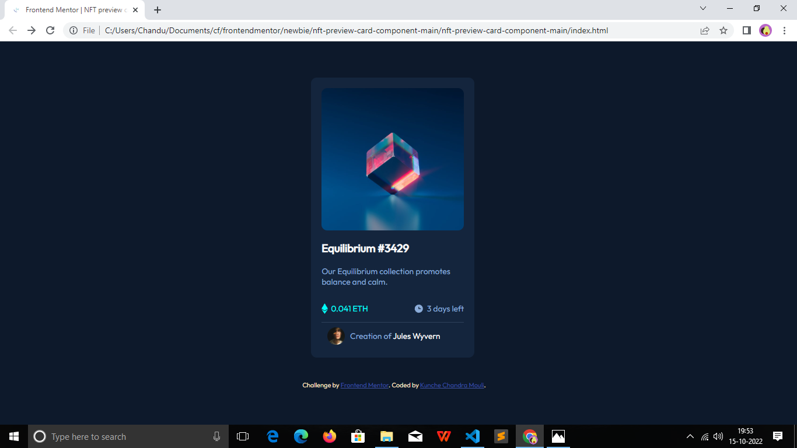
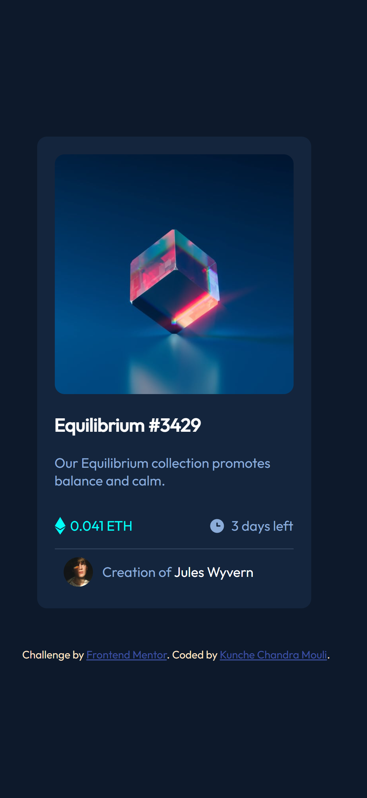

# Frontend Mentor - NFT preview card component solution

This is a solution to the https://www.frontendmentor.io/challenges/nft-preview-card-component-SbdUL_w0U. Frontend Mentor challenges help you improve your coding skills by building realistic projects. 

## Table of contents

- overview
  - the-challenge
  - screenshot
  - links
- my-process
  - built-with
  - what-i-learned
  - continued-development
  - useful-resources
- author

## Overview

### The challenge

Users should be able to:

- View the optimal layout depending on their device's screen size
- See hover states for interactive elements

### Screenshot

### Links

- Solution URL: (https://github.com/chanduKunche/nft-preview-card-component)
- Live Site URL: (https://chandukunche.github.io/nft-preview-card-component/)

## My process

### Built with

- Semantic HTML5 markup
- CSS custom properties
- Flexbox
- CSS Grid
- Mobile-first workflow

### What I learned

- how to design a preview card component using HTML and CSS.
- how to use flexbox and grid CSS properties.
- how to implement image hover overlay.
- how to build responsive webpages for big and small screens. 

### Continued development

In this project I did not include the border around the image avatar which I was struggling to implement. In the future projects I will try to implement that feature by learning the process of making one.

### Useful resources

- https://www.w3schools.com/howto/howto_css_image_overlay.asp - This helped me to implement the image hover overlay which was hard for me initially. I really liked this pattern and will use it going forward.

## Author

- Frontend Mentor - https://www.frontendmentor.io/profile/chanduKunche

